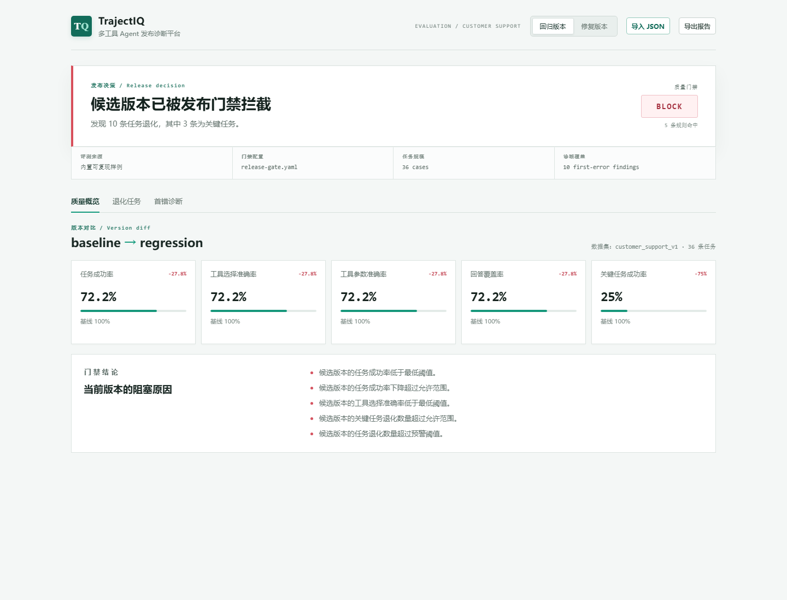

# TrajectIQ

[](https://github.com/yibo0210/TrajectIQ/actions/workflows/release-gate.yml)

TrajectIQ 是一个面向多工具 Agent 的发布质量诊断平台。项目以 Phoenix 和 OpenTelemetry 提供可观测性基础，在此之上实现版本回归评测、首错定位与 CI 发布门禁。



## 项目状态

`v1.1` 已完成：在 v1.0 基础上增加可复现的生产指标遥测，包括 Span 延迟、Prompt/Completion/Total Token、模型价格估算成本，并将延迟、Token 和成本阈值接入 YAML 发布门禁与 Dashboard。

### 可量化结果

- **36 条**版本化客服评测任务，覆盖退款、订单、物流、退货政策和人工升级。
- **10 条**回归任务可稳定复现，其中 **3 条**关键任务会触发发布阻断。
- **22 项**自动化测试覆盖 Agent、评测、Trace 适配、门禁和 Dashboard 数据。
- 同时对比任务质量、工具选择、平均延迟、Token 用量和估算成本。
- `fixed` 版本通过默认门禁，`regression` 版本被 CI 以 `BLOCK` 状态拦截。

## 项目结构

```text
trajectiq/
├── src/trajectiq/        # Agent 运行时、评测与发布门禁
├── src/trajectiq/datasets/ # 版本化 JSONL 评测集
├── tests/                # 独立测试
├── dashboard/            # React 发布诊断界面
├── ARCHITECTURE.md        # 组件关系与数据流
├── ROADMAP.md             # 版本计划与验收标准
└── release-gate.yaml     # 发布质量阈值
```

## 核心能力

- 以 `baseline`、`regression`、`fixed` 三个版本复现 Agent 行为差异。
- 在 36 条客服任务上评估退款、订单查询、物流、退货政策和人工升级。
- 对基线通过、候选失败的任务识别回归，并定位第一处工具调用分歧。
- 将任务成功率、工具选择、参数正确性、回答覆盖率和关键任务质量写入发布门禁。
- 为每个 Span 记录可复现的延迟、Prompt/Completion/Total Token 和美元成本估算。
- 在版本报告与 Dashboard 中对比平均延迟、Token 用量和成本，并通过 YAML 阈值执行发布门禁。
- 生成 Dashboard JSON，一页展示发布结论、任务退化和执行轨迹。
- 支持导入任意 Agent 的标准化执行轨迹，对接同一套评测与回归判断逻辑。

其中 `regression` 版本会故意将退款请求错误路由至 `estimate_delivery`。它稳定产生 10 条退款回归，其中 3 条是关键任务；`fixed` 版本可通过默认门禁。

## 本地运行

在项目根目录安装依赖并运行版本：

```bash
python -m pip install -e .[dev]
trajectiq --version baseline
trajectiq --version regression
```

生成回归报告与首错诊断：

```bash
trajectiq-regression --baseline baseline --candidate regression
trajectiq-diagnose --baseline baseline --candidate regression
```

执行发布门禁：

```bash
trajectiq-gate --baseline baseline --candidate fixed
trajectiq-gate --baseline baseline --candidate regression
```

第一个命令输出 `PASS`，第二个命令输出 `BLOCK` 且以状态码 `1` 退出，可直接接入 CI。

## Dashboard

Dashboard 默认加载仓库中由评测命令生成的真实报告，而非手写样例：

```bash
cd dashboard
pnpm install
pnpm dev
```

页面可切换回归版本与修复版本，也支持导入自定义 JSON：

```bash
trajectiq-dashboard-data --baseline baseline --candidate regression --output dashboard-report.json
```

## 外部 Agent 轨迹评测

TrajectIQ 不只评测仓库内置 Agent。任何运行时只要将执行结果转换为 TrajectIQ 的轻量 JSON 轨迹格式，即可完成版本比较：

```bash
trajectiq-trace-regression \
  --baseline-traces exports/baseline.json \
  --candidate-traces exports/candidate.json \
  --format markdown
```

对于 Phoenix 或 OpenTelemetry 导出的原始 Span JSON，可直接启用 OpenInference 适配器，不需要自行转换工具调用：

```bash
trajectiq-trace-regression \
  --baseline-traces exports/baseline-otel.json \
  --candidate-traces exports/candidate-otel.json \
  --input-format openinference
```

项目还提供一个真实 OpenAI 兼容工具调用示例。配置 API Key 后默认只运行一条任务，避免意外消耗额度：

```bash
$env:OPENAI_API_KEY = "your-key"
trajectiq-openai-demo --task-id refund_001 --output exports/live-candidate.json
```

需要同时导出到 Phoenix 时：

```bash
trajectiq-openai-demo --task-id refund_001 --trace --endpoint http://localhost:6006
```

`--all` 才会运行完整 36 条评测任务；API Key 仅从环境变量读取，不会写入报告。可从 `.env.example` 查看需要配置的环境变量；面试或项目演示可参考 [项目讲解](docs/interview-guide.md) 和 [演示 Runbook](docs/demo-runbook.md)。系统学习 Phoenix、OpenInference 与 TrajectIQ，请参考 [面试学习手册](docs/phoenix-trajectiq-study-guide.md)。

没有 API Key 时，可以使用内置的确定性 OpenAI 兼容 Mock 服务验证完整工具调用链路：

```bash
trajectiq-openai-demo --mock --task-id refund_001 --output exports/mock-agent.json
```

该命令仍然通过 Chat Completions HTTP 协议返回 `tool_calls`，但不访问外部网络，也不代表真实大模型效果。GitHub Actions 中的 `mock-agent-integration.yml` 仅支持手动触发，用于生成可下载的 Mock Agent 轨迹 Artifact。

评测集以 JSONL 管理，每条任务包含类别、标签、关键任务标识、预期工具链、参数和回答断言。可通过 `--dataset` 传入自己的版本化数据集。完整格式见 [外部轨迹接入说明](docs/trajectory-schema.md)。

## CI 质量反馈

GitHub Actions 会执行测试与发布门禁，将 Markdown 报告上传为 Artifact，同时写入工作流摘要；在 Pull Request 中会更新同一条 TrajectIQ 质量评论。

## Phoenix Trace 导出

启动 Phoenix 后执行：

```bash
trajectiq --version baseline --trace --endpoint http://localhost:6006
```

每个任务会生成 `agent_run` 根 Span，以及 `planner`、工具调用和 `final_answer` 子 Span，可在 Phoenix 中查看完整执行链路。

## 项目边界

Phoenix 负责 Trace 存储、界面、数据集和评测基础设施；TrajectIQ 独立实现 OpenInference 轨迹适配、版本化评测集、回归比较、首错归因和发布门禁，因此可以作为完整的 Agent 质量工程个人项目运行与演示。

当前版本优先保证 CI 的可重复性和本地演示体验。评测集仍是 36 条确定性任务，生产指标中的成本是基于模型价格表的估算值；真实模型调用默认不进入自动门禁，以避免 API 波动和不可控费用。项目暂未引入历史运行数据库、统计显著性分析、多租户和权限系统，这些属于面向团队部署的后续方向，而不是当前个人项目的必要依赖。
